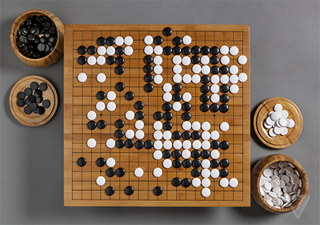

<h1 align="center"> FP Project - Goban </h1>

  

This repository contains the projects for the "Fundamentos da Programação" (Fundamentals of Programming) course @IST Instituto Superior Técnico (2023/2024). The coursework was divided into two main Python projects, starting with foundational concepts of grid manipulation and culminating in a fully playable game of Go.

## Part 1 - Mountains and Valleys

The first project served as an introduction to manipulating grid-based data structures and implementing algorithms for pathfinding and analysis.

* **Territory Representation:** A territory was represented as a tuple of tuples, where each inner tuple corresponds to a vertical column on a grid. Mountains were marked as `1` and empty intersections as `0`.
* **Coordinate System:** Functions were developed to handle intersections using a coordinate system of letters for columns and numbers for rows (e.g., 'A', 2).
* **Core Functionality:**
    * **Validation:** Created functions to validate the integrity of the territory and intersection data structures.
    * **Grid Analysis:** Implemented algorithms to find adjacent intersections, identify connected components (chains of mountains or empty spaces), and determine the "valley" of a mountain (all adjacent empty intersections).
    * **Information Extraction:** Developed functions to calculate the total number of mountains, the number of distinct mountain chains, and the total size of all valleys in the territory.
    * **Visualization:** A key function (`territorio_para_str`) was written to convert the internal representation of the territory into a human-readable string for display in the console.

## Part 2 - Go Game

The second project was a complete implementation of the board game Go, focusing on the use of Abstract Data Types (TADs) to structure the program and manage the game's state and rules.

* **Abstract Data Types (TADs):** The project was built around three core TADs, ensuring a clean separation between data representation and logic:
    1.  **TAD `intersecao`:** An immutable type to represent a single intersection on the board.
    2.  **TAD `pedra`:** A type to represent a stone, which could be black, white, or neutral (empty).
    3.  **TAD `goban`:** A mutable type representing the game board, handling the placement and removal of stones.
* **Game Logic and Rules:**
    * **Core Mechanics:** Implemented functions for placing stones, identifying chains (connected stones of the same color), and calculating their liberties (adjacent empty points).
    * **Capture System:** Developed the logic to capture an opponent's chains by removing all their liberties.
    * **Territory Calculation:** Created algorithms to identify and calculate territories controlled by each player at the end of the game.
    * **Illegal Moves:** The implementation correctly handles illegal moves, including the "suicide" rule (a move that results in the immediate capture of your own pieces) and the "Ko" rule (which prevents repeating a previous board state).
* **Main Game Loop:** A main `go` function orchestrates the game, managing player turns, validating moves, updating the board state, calculating scores, and determining the winner.
